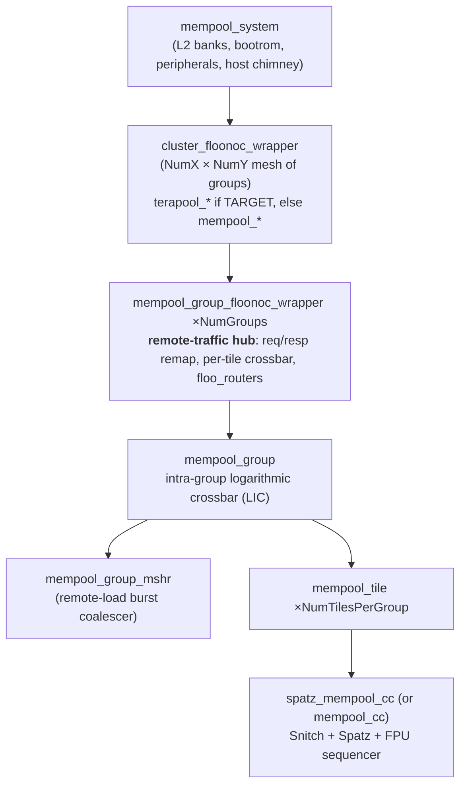
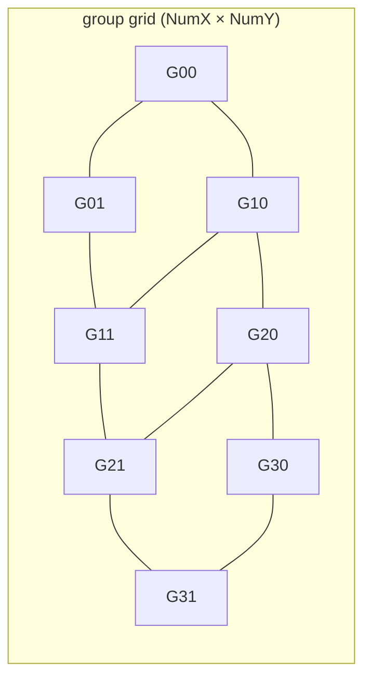
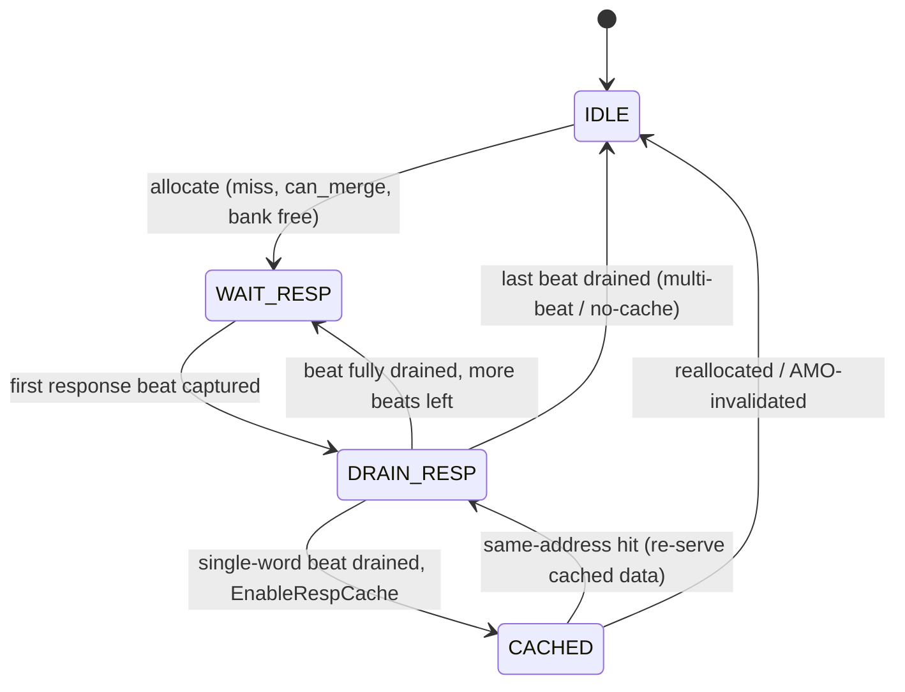
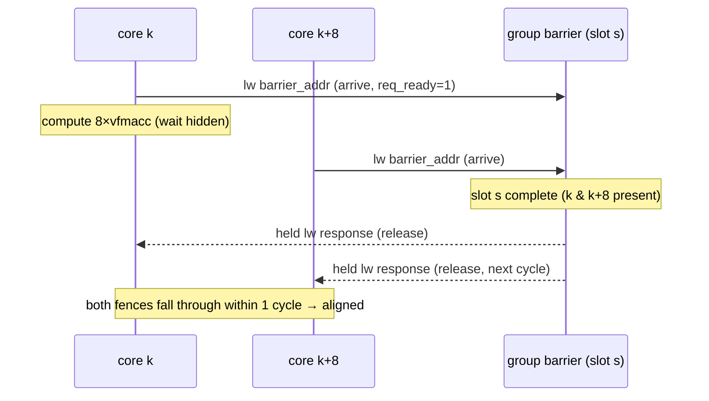

# TeraNoC + Spatz — Architecture & Microarchitecture Specification

**A hybrid mesh–crossbar Network-on-Chip for scaling shared-L1 RISC-V manycore clusters to 1000+ cores.**

This document is the narrative architecture/microarchitecture reference: design goals, block
structure, the NoC, the group-MSHR burst coalescer, the Spatz vector integration, the configuration
space, and the design rationale (including measured sizing studies and the deadlock analyses that
shaped the response path). For a terse, `file:line`-anchored debugging map see
[`../hardware/ARCHITECTURE.md`](../hardware/ARCHITECTURE.md).

> All structural claims are anchored to `file:line` in the form `mempool_group_mshr.sv:705`.
> Line numbers drift; verify before relying on them. Modules under `working_dir/spatz/` or
> `hardware/deps/` must be confirmed *compiled* via the relevant `Bender.yml` before being trusted —
> see [`../hardware/ARCHITECTURE.md` §0](../hardware/ARCHITECTURE.md#0-compiled-vs-not-read-this-first).

---

## 1. Introduction & design goals

TeraNoC is branched from [MemPool](https://github.com/pulp-platform/mempool) and integrates
[FlooNoC](https://github.com/pulp-platform/FlooNoC) mesh routers and the
[Spatz](https://github.com/pulp-platform/spatz) vector extension. The target is a **shared-L1
manycore** that preserves MemPool's low-latency, all-to-all TCDM programming model while scaling the
core count past the point where a single flat crossbar is physically realizable.

The central tension and the three design pillars that resolve it:

1. **Hybrid interconnect.** A flat logarithmic crossbar does not scale to 1000+ cores. TeraNoC keeps a
   **combinational logarithmic crossbar inside each group** (low-latency local sharing) and connects
   groups with a **2D-mesh of narrow 32-bit FlooNoC routers** (physically scalable global traffic).
2. **Group MSHR / remote-load burst coalescing.** Remote traffic is the scaling bottleneck. A
   per-group MSHR **merges outstanding remote loads** to the same line and **multicasts the single
   returned response** to all requesters, cutting both request pressure and redundant response
   bandwidth. (Project pillar 1.)
3. **Spatz VLSU burst support.** The Spatz vector LSU **auto-splits aligned unit-stride loads into
   16-word bursts**, turning many single-word remote requests into a few burst requests the MSHR can
   coalesce efficiently. (Project pillar 2.)

Hardware is SystemVerilog (`hardware/src/` + vendored IP under `hardware/deps/` and `working_dir/spatz`);
software is C compiled with RISC-V GCC/LLVM.

---

## 2. System architecture

### 2.1 Hierarchy



Anchors: `mempool_system.sv:10,553`; cluster wrapper choice `mempool_system.sv:101/351`; group wrapper
`mempool_group_floonoc_wrapper.sv:161`; tiles `mempool_group.sv:108,125`; MSHR `mempool_group.sv:627`
(gated by `EnableGroupMshr`, default 1); core complex `mempool_tile.sv:221,242`.

A leaf **core complex** is a Snitch scalar core plus (on Spatz flavors) a Spatz vector unit and FPU
sequencer (`spatz_mempool_cc`). Plain MemPool flavors pack 4 scalar `mempool_cc` cores per tile; Spatz
flavors use one complex per tile (`num_cores_per_tile=1`).

### 2.2 The two-tier interconnect

| | Intra-group | Inter-group |
|---|---|---|
| Topology | logarithmic crossbar (`LIC`) | 2D-mesh (default) or torus |
| Width | full TCDM word | 32-bit FlooNoC flits |
| Latency | combinational (no pipeline regs) | per-hop, FIFO-buffered |
| Module | `variable_latency_interconnect i_local_interco` `mempool_group.sv:245` | `floo_router` per tile/channel, `mempool_group_floonoc_wrapper.sv:811+` |

The group wrapper bridges the two: it converts MemPool TCDM request/response structs to/from FlooNoC
flits, steers arriving flits to the correct tile via per-tile `stream_xbar` crossbars
(`:519` req, `:697` resp), and hosts the routers.

---

## 3. Memory hierarchy & address mapping

```
Registers → L1 TCDM (shared, banked) → L2 (interleaved SRAM or DRAMSys) → (DRAM)
```

- **L1 TCDM** is the shared scratchpad. `NumBanks = NumCores · NumFUsPerCore · BankingFactor`
  (`mempool_pkg.sv:71`); per-bank size `L1_BANK_SIZE` (`:70`). Total `TCDMSize = NumBanks·TCDMSizePerBank`
  (`:503`).
- **Two address regions**, resolved by `address_scrambler.sv`:
  - **Sequential** (`addr < NumTiles·SeqMemSizePerTile`): bits are swapped so consecutive addresses map
    to *different* tiles — software sees a per-tile-contiguous block while physical accesses are
    tile-interleaved (`address_scrambler.sv:72–73`). Linker `.l1_seq` (NOLOAD), used for `domain_malloc`
    and stacks (`software/runtime/link.ld:15`, `arch.ld.c:23,27`).
  - **Interleaved (SPM)**: word-interleaved across banks for bandwidth; optional `TileIdRemap` strided
    remap (`address_scrambler.sv:74–79`). Linker `.l1_prio`/`.l1` (`link.ld:21`).
- **L2** at `L2_BASE=0x8000_0000` (`mempool_system.sv:583`), size/banks per flavor. `axi_L2_interleaver.sv`
  scrambles AXI addresses across L2 banks (granularity `Interleave`, `mempool_pkg.sv:89`); `axi2mem.sv`
  adapts AXI bursts to SRAM (or DRAMSys is linked in). Bootrom `0xA000_0000`, peripherals `0x4000_0000`.

---

## 4. Network-on-Chip

### 4.1 Channels

Inter-group TCDM traffic is split across up to three router families per tile, selected by
`channel_config_mode` (every flavor sets one of `baseline`/`narrow`/`enhanced`):

| Family | Flit type | Carries | Always present? |
|---|---|---|---|
| wide-req | `floo_tcdm_rdwr_req_t` (header + payload) | read & write requests | yes (`:873/899`) |
| resp | `floo_tcdm_resp_t` | all responses | yes (`:930/956`) |
| narrow-req | `floo_tcdm_rd_req_t` (header only) | read-only requests | only iff `USE_NARROW_REQ_CHANNEL` (`noc_req_rd_channel_num>0`) |

`channel_config_mode` derives `noc_req_{rd,rdwr,wr}_channel_num` and `noc_resp_channel_num`
(`config/terapool.mk:55–78`), which become `Num{Narrow,Wide}RemoteReqPortsPerTile` /
`NumRemoteRespPortsPerTile` (`mempool_pkg.sv:361–370`). `baseline` = 2 wide-req + 2 resp;
`narrow` adds a narrow-req channel; `enhanced` raises resp to 3.

AXI (L2/DMA) traffic uses a separate FlooNoC narrow-wide network: one `floo_nw_chimney` +
`floo_nw_router` per group (`:994,1046`), source-routed via `floo_terapool_noc_pkg::RoutingTables`.

### 4.2 Topology & routing



- **Topology** `NocTopology`: 0 = 2D-mesh (mesh boundaries terminate), 1 = torus (boundaries wrap)
  (`mempool_pkg.sv:374`; wrap wiring `terapool_cluster_floonoc_wrapper.sv:120–242`).
- **Routing** `NocRoutingAlgorithm` for the mesh: 0 = XY (dimension-order, default), 1 = OddEven
  (adaptive, turn-restricted), 2 = O1 (`mempool_group_floonoc_wrapper.sv:839,897,954`; implementations in
  FlooNoC `floo_route_select.sv`). The torus path uses table-driven `IdTable` routing from
  `routing_table_pkg.sv:22` (a 4×4 array of 16-rule tables, generated by `scripts/gen_routing_table.py`).
- **Virtual channels:** `noc_virtual_channel_num` is a **placeholder** — not consumed in `hardware/src`;
  every `floo_router` hardwires `NumVirtChannels=1`. VC-capable routers exist in deps but are not
  instantiated. (Consequence: XY + single-VC mesh cannot *routing*-deadlock, but the *protocol* can — §5.5.)

### 4.3 Load-balancing knobs

- **`noc_router_remapping`** (0/1/2/3): inserts `floo_remapper` permutation stages on req and/or resp to
  spread traffic across router input ports and reduce hotspots (`:264,577`; remapper rotates a
  `stream_xbar` selection each cycle, `floo_remapper.sv:69`). Group size `noc_router_remap_group_size`.
- **`noc_port_hash`** (bitmask): bit0 req-port round-robin (`mempool_tile_rw_demux.sv:83`), bit1 resp
  temporal RR, bit2 resp spatial RR (`mempool_tile.sv:537`).
- **Router FIFO depth** `noc_router_{input,output}_fifo_dep` (default 2) — first lever when router
  backpressure stalls appear (`floo_router` `InFifoDepth/OutFifoDepth`).

---

## 5. Group MSHR — remote-load burst coalescer 🔧

`mempool_group_mshr.sv` is the actively-developed heart of project pillar 1. It sits between the group's
tiles and the inter-group routers (`mempool_group.sv:627`), coalescing outstanding remote loads and
multicasting responses. (A stale `mempool_group_mshr.sv.bak` sits beside it — ignore it.)

### 5.1 Why coalesce

Under matmul-style traffic, many cores in a group issue remote loads to the **same** lines (shared B
operand). Without coalescing, each becomes an independent request+response crossing the mesh. The MSHR:
- **merges** same-line requests into one outstanding NoC request (cuts request bandwidth), and
- **multicasts** the single returned line to every merged requester (cuts response bandwidth).

By conservation, post-merge group response traffic equals the unique-line demand regardless of merge
degree; coalescing relieves *request congestion and shared latency*, not the per-core receive ceiling
(see [§8 evaluation] and `project_vlsu_burst_response_bw_ceiling`).

### 5.2 Entry array & banking

- `MshrNum` entries (`group_mshr_num`, default `NumTilesPerGroup`; 64 on terapool) split into
  `MshrBankNum = MshrNum/MshrWaysPerBank` banks of `MshrWaysPerBank=4` ways (`mempool_group_mshr.sv:23,31,111`).
- A `(tgt_group, addr)` key hashes to a bank by XOR-folding address bits above `BurstAlignBits` with the
  group id (`mshr_bank_of`, `:119–126`) — folding above the burst-align boundary keeps a burst's beats in
  one bank.
- Entry struct `mempool_group_mshr_t` (`:152–196`): `base_addr` (merge key), `tgt_group_id`, `burst_len`,
  `sub_reqs[MshrMergeReqs]` (per-requester records, index 0 = owner), `beat_pending`/`beats_left`/
  `beat_seen`/`beat_done` (out-of-order beat tracking), a small `resp_buf[RespBufWords]` response FIFO,
  and a 2-bit `state`.

### 5.3 Coalescing / admission

- A request is a merge candidate (`req_can_merge`) only if it is a pure load in an enabled size tier:
  single (`EnableMshrSingleReq`, default off), non-full burst (`EnableMshrNonFullBurstReq`, default on),
  or full burst (`EnableMshrFullBurstReq`, default on) — `:38–40,594–599`.
- **Hit (merge into a resident entry)** requires address+group+burst_len match, the entry in
  `WAIT_RESP` with no beats drained yet (or a `CACHED` hit for single words), no inflight/seen response,
  and room (`sub_reqs_num+1 ≤ MshrMergeReqs`) — `:847–859`.
- **No-late-join rule:** a burst merge is accepted only before the first response beat arrives
  (`:750–767`); once `mshr_resp_seen_now` is set, further merges are blocked. A same-address request that
  *misses* the join window allocates a **second entry** with a distinct `meta_id` range — two entries per
  address is *legitimate*, responses route by `(tile_id, core_id, meta_id range)` not address
  (`:773–780`). The single-word duplicate hazard is structurally closed by the `cached_entry_holds_data`
  invariant (`:697–711`).
- **Stall-and-merge:** a mergeable miss that loses its bank's single allocation slot this cycle stalls
  and retries — next cycle it either wins the slot or merges the entry the winner created, preserving full
  coalescing with no extra entry and no bypass (`:1325–1333`).

### 5.4 Response path & FSM



States `mshr_state_t` (`:134–139`). Response routing is **O(1)**: the returning `mshr_tag` (stamped at
allocation as `entry_id+1`, tag 0 = bypass sentinel) directly indexes the table (tag→`entry_id`,
`:1444–1457`). A matched
beat is captured into `resp_buf` (`:1497–1523`); at the head of each drain the entry sets `beat_pending`
for every valid sub-requester (`:1547–1557`) — this fan-out is the **multicast** of one returned line to
all coalesced followers. With `DrainMultiPort=1` (default) up to N response ports drain one sub-request
each per cycle (`:1596–1621`); the next head beat's `beat_pending` only initializes once the current one
is fully cleared (≈ one beat per entry per cycle). `EnableRespCache` keeps the last drained single-word
line as a best-effort cache (`CACHED`) for future same-address hits; any AMO invalidates all cached
entries (`:1419–1426`).

**Round-robin fairness** (three independent free-running counters, `EnableRrFairness=1`): `alloc_rr_q`
(requester priority per bank), `drain_mshr_rr_q` (entry scan), `subreq_rr_q` (sub-req scan) — all advance
unconditionally so priority cannot be frozen (`:313–339,1016–1027`).

### 5.5 The response-channel deadlock and the response sink (key rationale)

The defining correctness episode of this design. `sp-fmatmul-opt-burst-merge` on terapool hung
permanently (~cyc 8850, ~12.6k transactions frozen). Root cause (evidence-locked via the per-flit tracer,
`bottleneck_analysis/2026-06-12_noc_deadlock_fix_report.md`):

```
core stalled (in-order, awaiting a load)
  → group_mshr_resp_ready_i low
  → resp_out_ready low            (depth-1 output spill i_spill_resp_out fills, :509–518)
  → resp_in_ready low             (bypass path acceptance gated by that spill)
  → mshr_noc_resp_ready_o low     → back-pressures the SHARED response channel
  → head-of-line block: every response queued behind it (for OTHER cores) freezes
  → one of those is the load the stalled core is waiting on → circular wait → deadlock
```

This is a **message-dependent (head-of-line) deadlock**, not a routing deadlock — so virtual channels and
deepening `resp_buf` do **not** fix it. The cure is a **guaranteed response sink**: make
`mshr_noc_resp_ready_o` independent of the consumer by giving each `(tile, resp-port)` a deep FIFO
(analysis used depth-32) so the MSHR accepts every NoC response unconditionally and never back-pressures
the network (`2026-06-16_resp_sink_fifo_bug_rationale_and_overhead.md`; cost ≈ 806k FF chip-wide ≈ 6.9 MGE
— a localized price for a hard correctness property). The current RTL retains output spill registers
(`SpillRespOut=1`) with the hazard documented in-line (`mempool_group_mshr.sv:509–518`); the deadlock is
therefore a **known open issue** on this branch (`project_sp_fmatmul_hang_g12`).

### 5.6 Configuration

`group_mshr_num`, `group_mshr_merge_reqs` (default 8), `group_mshr_enable_single`,
`group_mshr_enable_stats` + `group_mshr_stats_period` (`[GroupMerge]`-style stats), and the TB-side
`group_merge_profiling`. All resolved from build-defines inside the module (`:23–66`); only structural
counts are passed from `mempool_group.sv:628`.

---

## 6. Spatz integration & memory datapath

### 6.1 Core complex

`spatz_mempool_cc` = Snitch (compiled from `hardware/deps/snitch`) + Spatz vector unit + FPU sequencer.
TCDM ports: **port 0 is shared** by the Snitch integer LSU and the scalar FP-LSU (merged through a
`tcdm_id_remapper`, `spatz_mempool_cc.sv:308–325`); **ports 1..N belong to the VLSU**
(`gen_tcdm_assignment :270–287`). Port 0 never bursts (`burst_len=1`, `:379`).

### 6.2 Scalar FP loads (`flw`/`fsw`)

Decoded by Snitch as accelerator-memory ops (not integer loads) and offloaded on `acc_q*`
(`deps/snitch/src/snitch.sv:2320–2348`); intercepted by the FPU sequencer (`spatz_fpu_sequencer.sv:385–415`)
and serviced by its FP-LSU = `snitch_lsu.sv`, an **id-based, out-of-order** unit (`metadata_q[req_id]`,
`:99–121`) with `NumOutstandingLoads=16`. So scalar `flw` already pipeline (≤16 outstanding); there is no
1-outstanding serialization (`project_matmul_flw_serialization`). Results write the FP regfile and do not
generate an `acc` GPR writeback.

### 6.3 Vector LSU & burst splitting

The VLSU (`spatz_vlsu.sv`) auto-splits a unit-stride `EW_32` load with a 64-byte-aligned base and
`vl ≥ 16` words into **16-word bursts** on the VLSU ports (`:141–151,857–860`); a misaligned/remainder
tail falls back to single-word (`burst_tail_phase`). One burst word consumes one ROB id, so
`SpatzNumOutstandingLoads = max(NumIntOutstandingLoads, MaxBurstWords) = 16` keeps a full burst window
without id aliasing (`spatz_mempool_cc.sv:205–209`). A two-state FSM `{RunningLoad, RunningStore}` gates
direction; switching back to loads after stores requires the ROB drained **and** `store_count_q==0`
(`:600,943–958`) — hence a `vle` right after a `vse` stalls until stores fully commit.

### 6.4 The `acc`-writeback contract (a correctness footgun)

The compiled Snitch writeback arbiter acknowledges an accelerator response **only** when
`acc_pvalid_i & acc_pwrite_i` (`deps/snitch/src/snitch.sv:2900,2937,2946`); there is no path for
`acc_pvalid & ~acc_pwrite`. By design Spatz only raises `acc_pvalid` for ops with a scalar GPR writeback.
Any path that returns an `acc` response with `pwrite=0` (observed with a float→int `fmv.x.w`) leaves the
destination GPR's scoreboard bit set forever → the next dependent instruction hangs. Also: a shared 3-bit
`acc_mem_cnt` throttles combined `flw`+`vle`/`vse` in flight to 7 (`:2781–2819`). Software footgun
corollary: `mempool_barrier` and a scalar `fence` do **not** drain VLSU stores — cross-core readers need a
real store-completion guarantee. (See `project_matmul_build1_epilogue_hang`.)

---

## 7. Configuration space

`config/config.mk` (master, default `mempool`) includes `config/<flavor>.mk`; `?=` lets flavors override.

| Flavor | cores | groups | c/tile | num_x | Spatz | remap/hash | mshr_num | channel mode |
|---|---|---|---|---|---|---|---|---|
| `minpool` | 16 | 4 | 4 | 2 | – | 0 / – | dflt | narrow |
| `mempool` | 256 | 4 | 4 | 2 | – | 0 / – | dflt | baseline |
| `mempool_spatz4_fpu` | 64 | 4 | 1 | 2 | ✓ | 3 / 0 | 16 | baseline |
| `terapool_spatz4_fpu` | 256 | 16 | 1 | 4 | ✓ | 3 / 7 | 64 | baseline |
| `minpool_spatz4_fpu` | 4 | 4 | 1 | 2 | ✓ | 3 / – | dflt | baseline |
| `systolic` | 256 | 4 | 4 | – | – | dflt | dflt | (defaults) |

Spatz flavors: `vlen=512`, `n_fpu=n_ipu=4`, `rvf=1`/`rvd=0`, `elen=32`. Anchors in each
`config/<flavor>.mk`. The macros flow into `mempool_pkg.sv` localparams (§5 of the terse doc lists the key
lines).

---

## 8. Design rationale, evaluation & open issues

### 8.1 MSHR sizing study (measured, `bottleneck_analysis/`)

A version series quantified MSHR depth vs. merge efficiency on `terapool_spatz4_fpu`:

| Ver | Change | Result |
|---|---|---|
| v3 | MshrNum 16→32, EnableStats | 49% MSHR overflow, 24% in-MSHR merge rate |
| v4 | 32→64 | overflow 49%→17%, from_mshr 38%→74%; heavy phase ~29k cyc |
| v5 | →128 | overflow 0.1%, 97% from_mshr — over-sized (62% util), upper-bound reference |
| v6 | 64 + `noc_router_remapping=3` | **best**: merge_rate 0.41, overflow 5%, heavy phase ~26k cyc |

⇒ `group_mshr_num=64` + req+resp remapping is the shipped terapool operating point.

### 8.2 Throughput character

`sp-fmatmul` is **compute-bound** at the per-core FPU roofline (~16384 cyc/core for an 8×32 tile;
`project_sp_fmatmul_compute_bound`). Per-core burst-response receive is capped ~2 words/cyc by the MSHR
1-beat-per-entry drain × 2 usable response ports (`project_vlsu_burst_response_bw_ceiling`); a 4× lift
needs `noc_resp_channel_num=4`, not VLSU/port-select tweaks. Coalescing raises *efficiency under
congestion*, not the compute-bound ceiling.

### 8.3 Correctness audit (MSHR redesign, `2026-06-13_mshr_audit_and_redesign.md`)

A multi-agent adversarial audit confirmed 11 of 27 candidate findings. Notable, still-relevant ones:
- **H1** misaligned-burst `req_out.burst_len` not clamped → followers hang / wrong data (one-line clamp fix,
  mirrors the AMO clamp).
- **H2** follower merges into an un-allocated entry when its leader is blocked by `req_meta_conflict` →
  hang or stale-data; the banked redesign removes the same-cycle leader/follower mechanism structurally.
- **H3** store→CACHED write-through ignores byte-enables → sub-word store corrupts the cached word
  (byte-merge under `be`, or invalidate on partial store).

### 8.4 Open issues

1. **NoC response HoL-deadlock** (§5.5) — the response sink is specified but the current RTL still uses
   spill registers; this is the dominant correctness risk for 256-core matmul-style traffic.
2. **Virtual channels** are a placeholder (§4.2); a future resp-network VC scheme is a candidate mitigation
   secondary to the response sink.
3. The MSHR audit fixes (H1–H3) are latent under the current config but should be closed before relying on
   misaligned bursts, meta-id wrap, or remote sub-word stores.

---

## 9. Group sync barrier — held-response rendezvous 🔧 (EXPERIMENTAL · default-on · under review)

A per-group fine-grained barrier that lets a small set of cores **rendezvous in a handful of cycles**,
reusing the TCDM request/response datapath — no WFI, no wake wiring. Its first target was aligning the two
cores that share a B-column in `sp-fmatmul` so their vector bursts land in the MSHR merge window (§5.3); it
is built as a **general** primitive (any pairing/subset, with a config-write path left as future work). Files:
`hardware/src/mempool_group_barrier.sv` (the slave), the `gen_group_barrier` shim in `mempool_group.sv`, and
the SW runtime in `software/apps/.../sp-fmatmul-opt-burst-merge/kernel/sp-fmatmul.c`.

### 9.1 Mechanism (Design B — blocking load)

```
arrive : a core issues a single integer  lw  to the reserved barrier address
         -> the barrier slave ACCEPTS the request immediately (req_ready=1) but
            WITHHOLDS the response, recording the requester
wait   : the core later executes  fence  -> stalls (fence_stall = !lsu_empty,
            snitch.sv:861) until its held lw response returns
release: when all members of the core's slot have arrived, the slave drives the
         withheld responses back (one per cycle) -> each core's lw completes ->
         its fence falls through. The RELEASE *is* the load response.
```



Why blocking-load and not WFI/wake: it needs **zero interconnect change** (the local
`variable_latency_interconnect` already supports held / variable-latency responses, routed by the echoed
`ini_addr` — same pattern as the AMO path in `tcdm_adapter.sv`), avoids a new wake path, and avoids the WFI
`OutstandingWfi` desync against `mempool_barrier`. The wait naturally overlaps compute, preserving the
kernel's double-buffer. See `bottleneck_analysis/2026-06-21_barrier_loadresp_vs_wfi.md` for the A-vs-B
comparison.

### 9.2 Address map (review this)

The barrier is one reserved **L1 word** reached on the **local port 0** path. Because the local-interco
target address `master_local_req_tgt_addr` is the *packed* `tcdm_addr_t` — tile-id and the sequential/
interleaved view are already stripped (`mempool_tile.sv:1143–1145`) — the barrier is identified purely by
`{word_addr, bank_id}`:

| layer | value | notes |
|---|---|---|
| **SW byte address** (per core) | `0x0032_0000 \| (core_id << 6)` | `gbar_addr()`; `core_id = mhartid` (1 core/tile) |
| byte-addr fields (interleaved, identity scramble) | `word=200 (0xC8) @[21:14]`, `tile_id=core_id @[13:6]`, `bank=0 @[5:2]` | `0x320000 = 200<<14` |
| **routes** | local (tile_id == own tile) → port 0 | not remote/L2 |
| **packed `GroupBarrierTgtAddr`** | `tcdm_addr_t'(16'h0C80)` | `{word[7:0]=0xC8, bank[3:0]=0x0}`, bits[15:12]=0 |
| decode in shim | `master_local_req_tgt_addr == 0x0C80` | mempool_group.sv `gen_group_barrier` |

**Slot / pairing map** (hardwired, `NumGroupBarrierSlots = NumCoresPerGroup/2 = 8`):

| | |
|---|---|
| core `c` (core_gid 0–15) → slot | `c % 8` |
| slot `s` members | `{s, s+8}` |
| matches sp-fmatmul B-pairs | `p_start = 32·(core_gid%8)` → cores `k` and `k+8` share B |

**⚠ Aliasing caveat (the thing to decide on).** Since the packed `tgt_addr` drops the tile-id and the
seq-vs-interleaved view, `0x0C80` denotes *any* local access to `(bank 0, word 200)`. `sp-fmatmul`'s
`a/b/c` only span words ~8–56, so word 200 is free and the barrier is safe **for that kernel**. With the
barrier now **default-on for all apps** (§9.5), word 200 is **not yet linker-reserved**, so any other app
that legitimately touches `(bank 0, word 200)` of its own tile would be mis-diverted into the barrier
(hang/corruption). The fix is a one-word linker carve-out of `(bank 0, word 200)` from `.l1`/`.l1_prio`
before relying on default-on globally.

### 9.3 Microarchitecture

**Slave** (`mempool_group_barrier.sv`): per slot an `arrived_q` bitmask; a slot is *complete* when
`arrived_q == expect_mask` (`{s,s+8}`). A release FSM drains **one slot at a time, pair-major**
(`releasing_q`/`rel_slot_q`), emitting one response/cycle (`resp_valid` + `resp_ini_addr` = the core to
wake), AXI-vld/rdy compliant (holds `valid` until accepted). Per-slot **watchdog** (`WatchdogLimit=512`):
if a partner never arrives, the slot force-releases whoever *did* arrive and latches a sticky `wd_fire_o[s]`
stat — so a divergence is a *bounded stall*, never an unbounded `fence` hang. Pair-major release ⇒ the
coalescing-relevant intra-pair skew is 1 cycle even when several slots complete together; cross-slot
serialization is added latency, not skew (see report §6 for K-wide / 0-skew options, deferred).

**Shim** (`gen_group_barrier` in `mempool_group.sv`, "Option B4", master-side): barrier-window loads are
**masked out of the local interconnect** (`lic_req_valid`), arbitrated one-per-cycle into the slave
(`rr_arb_tree`), and the held response is **injected into the requester's master response channel** only
when the LIC is not driving that core that cycle. The shim captures the request payload (`meta_store_q`) so
the injected response **echoes the load's `meta_id`/`core_id`** — required for the Snitch integer LSU to
match the response to the outstanding `lw` (mirrors what a bank does). Under disable the nets are a literal
passthrough → bit-identical baseline.

### 9.4 Software usage

`GBAR_ARRIVE(addr)` = `lw` to `gbar_addr()`; `GBAR_WAIT()` = `fence`. In `matmul_8xVL` the arrive is placed
**after** each B `vle` prefetch and the fence **after** the half-step's 8 `vfmacc`, so the wait hides behind
compute and the next prefetch issues aligned. Use integer `lw` (not `flw`: `flw` is an accelerator-mem op,
not fence-gated); A-matrix loads are `flw`, so the `fence` waits only on the barrier `lw`.

### 9.5 Configuration

| knob | where | default | effect |
|---|---|---|---|
| `EnableGroupBarrier` | `mempool_group.sv` | **on** (`-DGROUP_BARRIER_OFF` to disable) | elaborate the slave + shim |
| `group_barrier=0` | `hardware/Makefile` | – | sets `-DGROUP_BARRIER_OFF` (A/B off-switch) |
| `NumGroupBarrierSlots` | param | `NumCoresPerGroup/2` (8) | pairs per group |
| `GroupBarrierWdLimit` | param | 512 | watchdog cycles |
| `GROUP_BARRIER` | kernel | 1 | SW emits arrive/fence (0 = baseline) |

### 9.6 Evaluation (so far)

A/B on `terapool_spatz4_fpu` (`bottleneck_analysis/`, WORKLOG 2026-06-22): the barrier is **functionally
correct** — a full clean run with no `wd_fire`, no stuck request, `orphan=0 dup_alloc=0`, and an adversarial
review (27 findings) confirmed **no deadlock/corruption**. But for `sp-fmatmul` it is a **no-op**:
cycles 27271→27193 (break-even), full-run aggregate coalescing unchanged (`merged/accepted` 0.288 vs 0.283).
The kernel is compute-bound (§8.2) and the cores already run roughly in lockstep, so explicit per-step
alignment changes neither cycles nor coalescing. **Verdict:** a verified, reusable rendezvous primitive,
but not a win for this kernel — its value (if any) is on a *non*-compute-bound, alignment-sensitive workload.

---

*Companion: [`../hardware/ARCHITECTURE.md`](../hardware/ARCHITECTURE.md) (terse, anchored, gotchas + debug
tooling). Design-history detail: `hardware/bottleneck_analysis/`. Keep `file:line` anchors honest as RTL
evolves; 🔧 marks actively-developed areas.*
